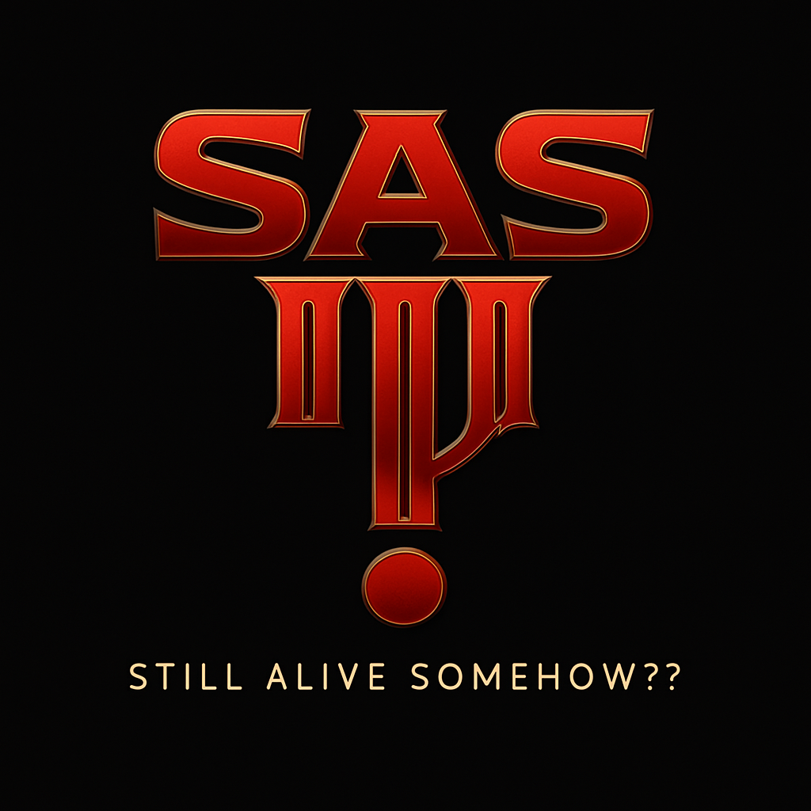
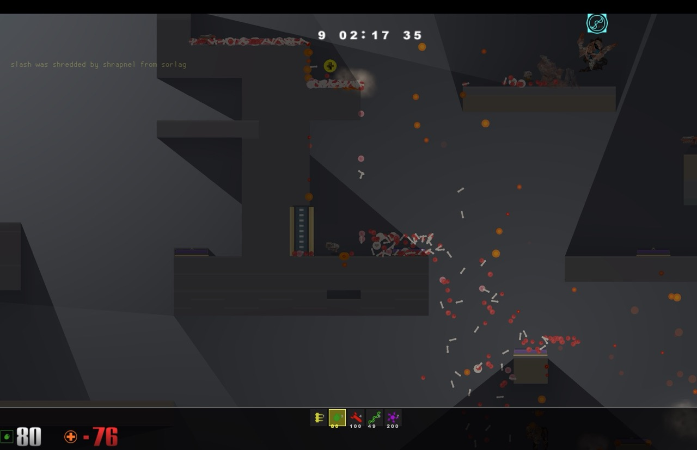
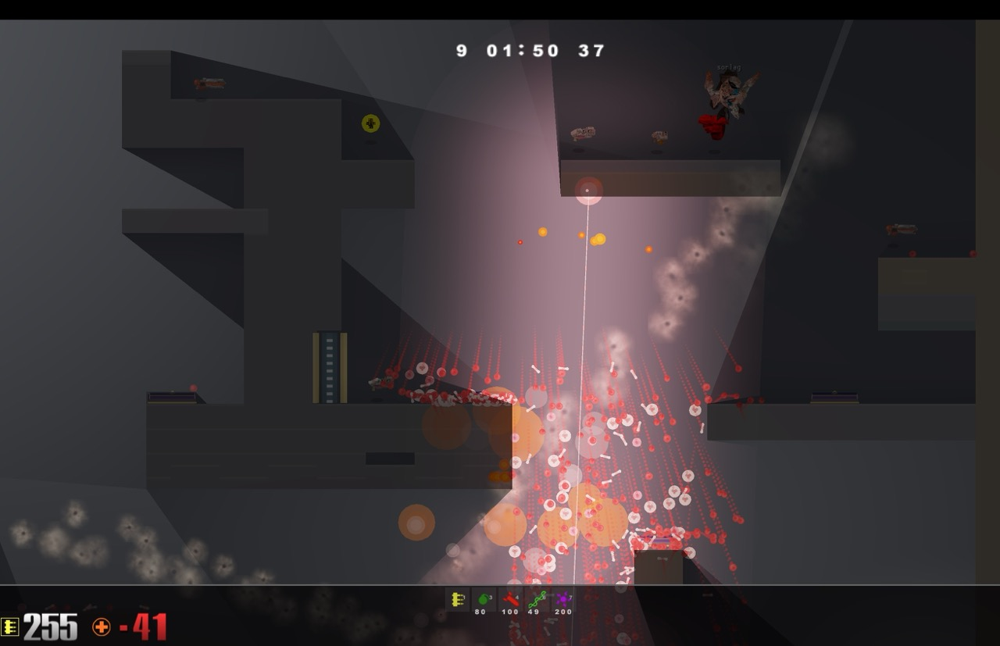

# SAS III
## Still Alive Somehow??



Да, это еще один arena shooter. Нет, я не знаю зачем. Да, он написан на Rust. Нет, это не сделало его быстрее.

### Что это?

Quake 3-inspired шутер, который пережил уже три итерации и до сих пор не понимает, зачем он существует. Есть боты, есть физика гибов, есть рельсотрон. Чего еще нужно для счастья в 2025?

### Скриншоты


*Физика гибов работает. Это главное.*


*Рельса есть. Значит, это настоящий арена шутер.*


*Плазма светится. Красиво же.*

### Запуск

```bash
cargo run --release
```

Или используй один из 47 билд-скриптов в корне проекта. Они все работают. Наверное.

### Фичи

- ✅ Боты с навигационными графами
- ✅ Сетевая игра (работает в 30% случаев)
- ✅ Карты в JSON (потому что XML это прошлый век)
- ✅ Dedicated server (для тех, кто хочет страдать в одиночку)
- ✅ WASM билд (запускается в браузере, тормозит везде)
- ✅ iOS поддержка (зачем? не спрашивай)
- ✅ Map editor (потому что блокнот это слишком мейнстрим)

### Системные требования

- Rust (последний, какой найдешь)
- Терпение
- Ностальгия по 1999-му году
- Готовность к тому, что ничего не работает с первого раза

### Лицензия

Делай что хочешь, я не твоя мама.

---

*v0.62.0 - версия, в которой мы наконец-то исправили тот баг... или нет*

**by Aleksandr Kuznetsov & 3d[Power]**

