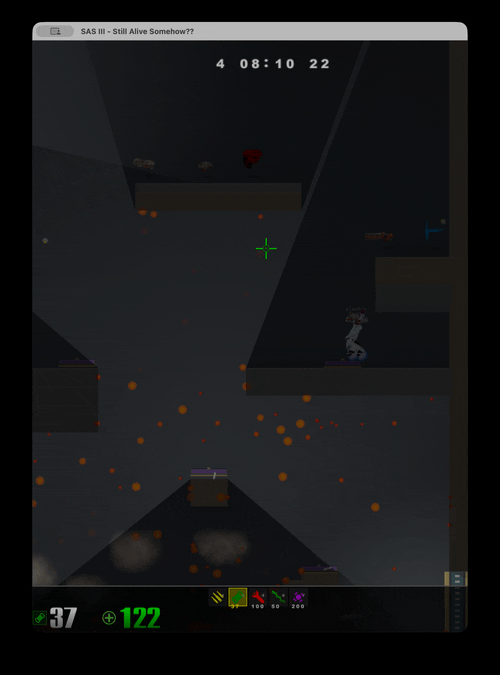
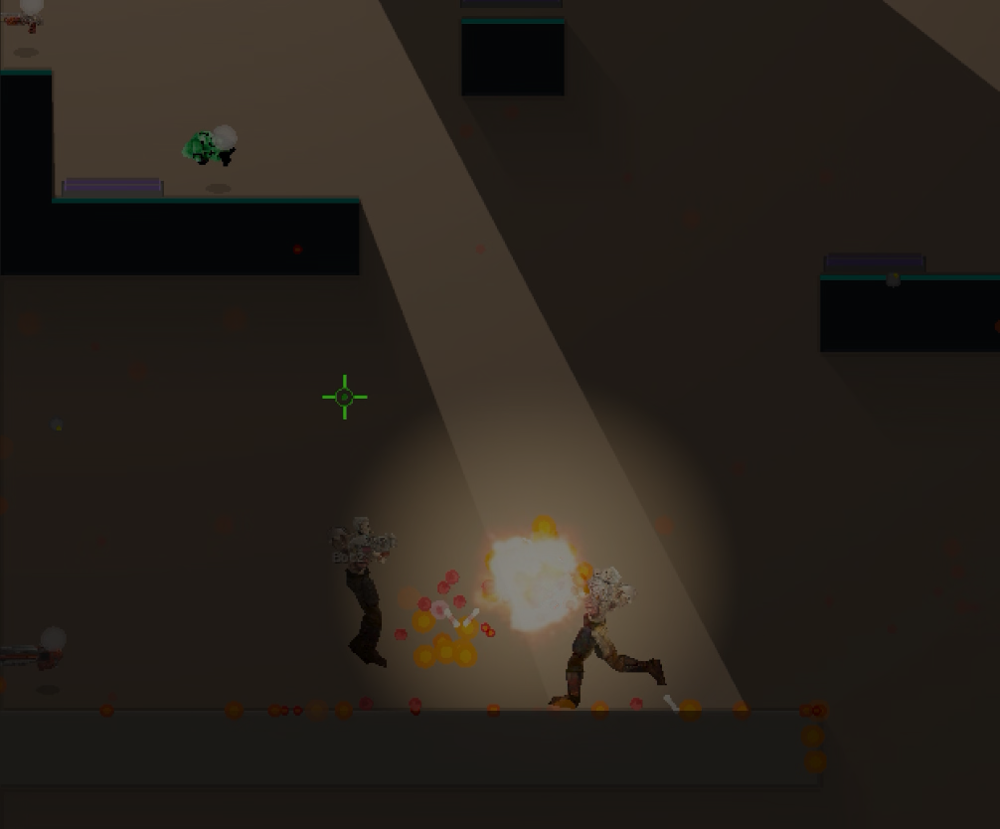

# SAS III
## Still Alive Somehow




*Да, у нас есть динамическое освещение.*

[English Version](README.md)

Ещё один арена-шутер на Rust. Потому что миру определённо был нужен ещё один.
Быстро, с багами, работает на чистой ностальгии и кофеине.

### Как установить
Я потратил на эти скрипты установки больше времени, чем на физический движок. Они прекрасны.

**macOS / Linux:**
```bash
curl -fsSL https://raw.githubusercontent.com/a-kuz/sas/main/scripts/install.sh | bash
```

**Windows (cmd):**
```cmd
curl -L https://raw.githubusercontent.com/a-kuz/sas/main/scripts/install.bat -o install.bat & install.bat
```

**Windows (PowerShell):**
```powershell
irm https://raw.githubusercontent.com/a-kuz/sas/main/scripts/install.ps1 | iex
```

### Важно
**Вам нужна лицензионная копия Quake 3 Arena** для игры.
Здесь только код; веселую часть id Software сделали 25 лет назад.

---

### Скриншоты


*Физика гибов работает. Это главное.*


*Рельса на месте. Значит, это настоящий арена шутер.*


*Плазма светится. Красиво же.*


